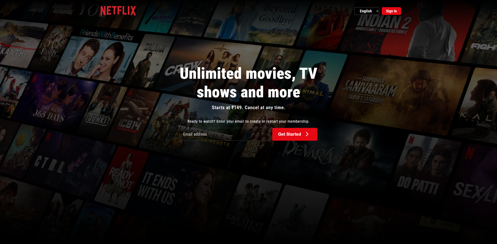

# 🎬 Netflix Homepage Clone

  
  


---

## 📖 Overview

This project is a **Netflix homepage clone** built using **HTML5** and **vanilla CSS**.  
It recreates the familiar Netflix landing page design with styled sections, modern layouts, and a visually engaging look.  
The goal of this project is to practice frontend skills and replicate real-world UI design using only fundamental web technologies.

---

## 🚀 Features

- 🎥 Netflix-inspired homepage design
- 🎨 Styled sections for banners, categories, and content
- 🖼️ Static layout using only HTML and CSS
- 📂 Beginner-friendly code structure
- 🌱 Great for practicing frontend fundamentals

> ⚠️ _Note: This version is not yet responsive. A responsive layout may be added in the future._

---

## 🛠️ Technologies Used

- **HTML5** → Page structure and content
- **CSS3** → Styling, layout, and design

---

## 📂 Project Structure

netflix-clone/
├── index.html # Main HTML file
├── style.css # Stylesheet
└── README.md # Documentation

## 📸 Preview

Example:  


---

## ⚡ Getting Started

To run this project locally:

1. Clone the repository:
   ```bash
   git clone https://github.com/paulIndit25/Netflix-Home-clone.git
   ```
